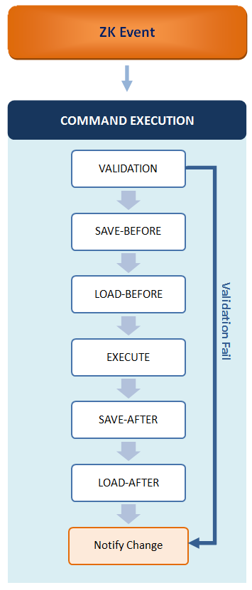

# Command Binding

Overview
========
Command binding is a mechanism for hooking up a UI component's event such as button's onClick to ViewModel's Command<sub>[1]</sub> without writing code. This binding is established by ` @command ` with command's name in a ZUL. We can only bind one event to only one Command but can bind multiple events to the same Command.

Command's name is the name of ViewModel's method with Java annotation ` @Command  ` by default. You can also specify a Command's name in ` @Command `'s element.

[1]: [ ViewModel/Commands](../viewmodel/commands.html)

#### Command method example
```java
public class OrderVM {

    // create and add a new order to a list
    // command name is set to method name by default
    @Command
    public void newOrder() {
        Order order = new Order();
        getOrders().add(order);
        selected = order;//select the new one
    }

    // save an order
    // command name is specified
    @Command("save")
    public void saveOrder() {
        orderService.save(selected);
    }
}
```

####Command binding example
```xml
    <toolbar>
        <button label="New" onClick="@command('newOrder')" />
        <button label="Save" onClick="@command('save')" />
    </toolbar>

    <menubar>
        <menu label="Order">
            <menupopup >
                <menuitem label="New" onClick="@command('newOrder')"/>
                <menuitem label="Save" onClick="@command('save')"/>
            </menupopup>
        </menu>
    </menubar>
```
- When clicking “Save” button or menuitem, the binder will invoke ` saveOrder() ` in a ViewModel.

You can pass parameters to a command method. Please refer [Advanced/Parameters](../advanced/parameters.html).

Empty Command
-------------
If we specify command name with an **empty string literal** or evaluation result of EL inside ` @command() ` is **null**, the binder will ignore that command. It's handy if you want to do nothing in some cases. For example:

####Empty command
```xml
<button onClick="@command(empty vm.selection ? 'add' : ''"/>

<button onClick="@command(empty vm.selection ? 'save' : null"/>
```

Default Command
---------------
> since 6.5.1

We can apply **`@DefaultCommand`** to mark a method as a default command method which is invoked only if a command binding doesn't match any other command methods. When a binder receives a command, it starts to find ViewModel's command methods by matching its name. Only if the binder cannot find a matched method, it invokes default command method.

Assume that there are only two command methos in the below ViewModel. If we trigger a command “exit”, a binder invokes the default command method `defaultAction()` because it cannot find a command method named “exit”.

#### ViewModel with default command method
```java
public class OrderVM {

    @Command
    public void newOrder() {
        // ...
    }

    @DefaultCommand
    public void defaultAction() {
        // ...
    }
}
```

Command Execution
=================
A command execution is a mechanism of ZK Bind where it performs a method call on the ViewModel. It binds to a component's event and when a binding event comes, binder will follow the life-cycle to complete the execution. There are 6 phases in the `COMMAND` execution: `VALIDATION`, `SAVE-BEFORE`, `LOAD-BEFORE`, `EXECUTE`, `SAVE-AFTER`, `LOAD-AFTER`.

### Saving and Loading in Command Execution
You could save multiple values to ViewModel at the same time before or after the `EXECUTE` phase (i.e., call the ViewModel's command method) by using the `@save(expression, before|after='a-command')` syntax (use this syntax, the value will not be saved immediately after being edited by user). You can also load values to a component before or after the `EXECUTE` phase by using the `@load(expression, before|after='a-command')` syntax.

### Validation in Command Execution
Validation is also included in the command execution. It is performed in the `VALIDATION` phase before any other phases. If there are multiple save bindings that depend on the same command, all validators of binding will be called in the `VALIDATION` phase. If a validator said invalid, the execution will be broken, and ignored in the remaining phases.

### Phases of Command Execution
Following is the phases of a Command Execution:



- When a bound ZK event enters the binder, the `COMMAND` phase will be invoked and all phases within the `COMMAND` phase will start to execute one by one
- In the `VALIDATION` phase, binder first collects all the properties that needs to be verified. Then, it calls each validator of save-binding that is related to this command. In each call to a validator, binder provides a new `ValidationContext` which contains the main property and other collected properties. This means, you can do dependent validation with collected properties, for example, checking whether the shipping date is larger than the creation date. If any validator reports invalid by calling `ValidationContext.setInvalid ()`, binder ignores all subsequent phases and loads other properties that has been notified for a change.
- In the `SAVE-BEFORE` phase, binder calls all the save-binding that is relative to the command and mark “before” to save the value to the expression
- In the `LOAD-BEFORE` phase, binder calls all the load-binding that is relative to the command and mark “before” to load the value from expression to the component
- In the `EXECUTE` phase, binder calls the command method of the ViewModel. For example, if the command is “saveOrder”, it will try to find a method that has annotation `@Command('saveOrder')` or a method which is named `saveOrder()` with `@Command()` of the viewModel, and then call it. If there is no method to execute, it complains with an exception.
- In the `SAVE-AFTER` phase, binder calls all the save-binding that is relative to the command and mark “after” to save the value to the expression
- In the `LOAD-AFTER` phase, binder calls all the load-binding that is relative to the command and mark “after” to load the value from expression to component
